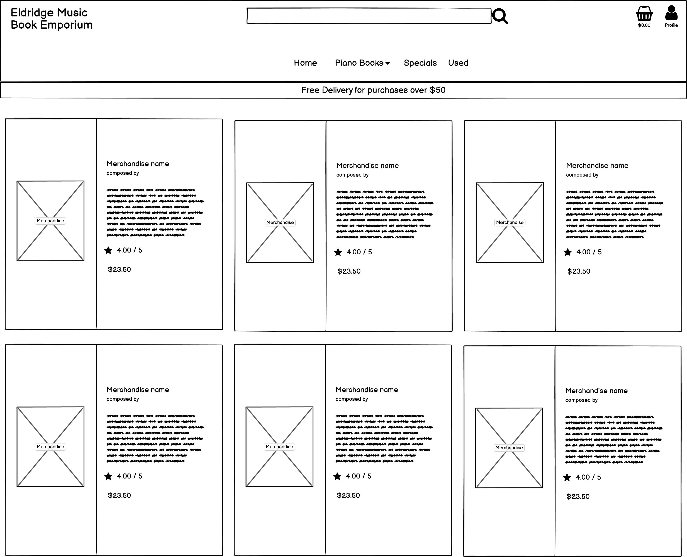
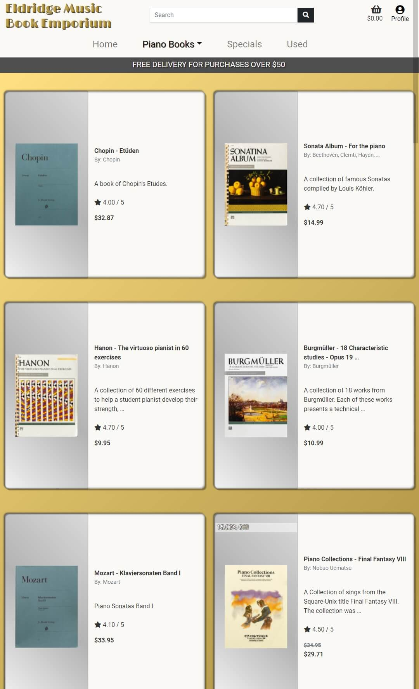

# Contents
[Eldridge Music Book Emporium - Introduction](#introduction)

[UX](#ux)
+ [User Stories](#user-stories)
+ [Design Choices](#design-choices)
    + [Base - Header](#base---header)
    + [Home](#home)
    + [All Account Login - Logout - Management Views](#all-account-login---logout---management-views)
    + [Merchandise](#merchandise)
    + [Specials](#specials)
    + [Used](#used)
    + [Merchandise Details](#merchandise-details)
    + [Cart](#cart)
    + [Invoice - Checkout](#invoice---checkout)
    + [Profile](#profile)
    + [Superuser Merchandise CRUD views](#superuser-merchandise-crud-views)
    + [Return Emails](#return-emails)
    + [Wireframe and Live App](#wireframe-and-live-app)
        + [Wireframe](#wireframe)
        + [Live App](#live-app)
    + [Scalability](#scalability)

[Technology and Languages](#technology-and-languages)

[Testing](#testing)

[Bugs and Other Problems](#bugs-and-other-problems)
+ [Current Bugs](#current-bugs)
+ [Other Problems](#other-problems)

[Deployment](#deployment)
+ [GitHub - GitPod](#github---gitpod)
+ [Heroku](#heroku)
    + [Link Heroku with Github](#link-heroku-and-github)
    + [Create a Postgres SQL Server](#create-a-postgres-sql-server)
    + [Enable Automatic Deployment or Manually Deploy Updates](#enable-automatic-deployment-or-manually-deploy-updates)
+ [Stripe](#stripe)
+ [AWS](#aws)
    + [Create S3 Bucket](#create-s3-bucket)
    + [Create and Configure IAM](#create-and-configure-iam)
+ [Return Emails with Gmail](#Return-emails-with-gmail)

+ [Heroku Variables](#heroku-variables)
+ [Django Settings](#django-settings)

[Tools and Credits](#tools-and-credits)
+ [Tools](#tools)
+ [Credits](#credits)
    + [References and Ideas](#references-and-ideas)
+ [Acknowledgements](#acknowledgements)

--------------------------------------------------------------------------------------

# Introduction
Eldridge Music Book Emporium is dedicated to spreading the love and appreciation of music through the exchange of used and new music books. 
We are a small shop that is entering the 21st century with our first e-commerce store! Currently we have plans to expand our 
music selection to include music books for instruments other than the piano in the future. Until then, please spend a moment 
to peruse our selection and hopfully give some lightly used music books a life!

# UX
## User Stories
+ As a shopper I want to view all the merchandise in the store.
    + I opened the home page of Eldridge Music Book Emporium. I clicked on **Music Books** on the header and I saw a drop-down menu. I then 
    clicked on, **All Music Books** and saw a list of all the music books on the site.
+ As a shopper I want to view detailed information about a piece of merchandise.
    + I opened the home page of Eldridge Music Book Emporium. I clicked on **Music Books** on the header and I saw a drop-down menu. I then 
    clicked on, **All Music Books** and saw a list of all the music books of the site. I found a book I liked and clicked on the merchandise 
    card and found all the detailed information I needed.
+ As a shopper I want to see all discounted merchandise.
    + I opened the home page of Eldridge Music Book Emporium. I clicked on **Specials** on the header and was taken to a page containing 
    all the discounted music books.
+ As a shopper I want to view all the items in my cart.
    + I was shopping and need to know the total of all my selected merchandise. I clicked on the **cart** button in the top right corner 
    of the page and I'm taken to a page where I could see all the items in my **cart** and the total cost.
+ As a shopper I want to be able to search available products by their category.
    + I opened the home page of Eldridge Music Book Emporium. I clicked on **Music Books** on the header and I saw a drop-down menu. I then 
    was able to select which category of music books I wanted to view.
+ As a shopper I want to be able to search for an item by its name or composer.
    + I opened the home page of Eldridge Music Book Emporium. I saw a **user input search bar** and input the composer I was searching for. I was 
    taken to a page that contains all available books composed by this composer.
+ As a shopper I want to receive a confirmation email upon checkout.
    + As I finish shopping I clicked the **Go to secure checkout** button and I am taken to a form that I must complete to check out. I finish 
    the form and I submit it. I checked my email account and found an invoice with detailed information about my purchase.

+ As a new user I would like a create an account.
    + I opened the home page of Eldridge Music Book Emporium. I clicked on the **profile** button on the top right corner of the page. A drop-down menu 
    appeared below the **profile** button and I clicked, **Create Account**. I was taken to a page where I started the process of creating an account.
+ As a new user I would like to receive a confirmation email after registering.
    + I opened the home page of Eldridge Music Book Emporium. I clicked on the **profile** button on the top right corner of the page. A drop-down menu 
    appeared below the **profile** button and I clicked, **Create Account**. I was taken to a page where I started the process of creating an account. 
    I checked my email account and found a confirmation email regarding my newly created account.

+ As a returning customer I would like to rate products I have purchased.
    + I opened the home page of Eldridge Music Book Emporium. I entered the title of a book I purchased in the **user input search bar** and clicked on the 
    merchandise card to get its **Details View**. I clicked on **Click to Rate**. I entered my rating in the text box that appeared and clicked **Rate me!**. 
    I was able to see the updated average rating.
+ As a returning user I would like to easily login or logout.
    + I opened the home page of Eldridge Music Book Emporium. I clicked on the **profile** button on the top right corner of the page. A drop-down menu 
    appeared below the **profile** button and I clicked, **Login**. I was taken to a page to login.
+ As a returning user I would like to recover my forgotten password.
    + I opened the home page of Eldridge Music Book Emporium. I clicked on the **profile** button on the top right corner of the page. A drop-down menu 
    appeared below the **profile** button and I clicked, **Login**. I was taken to the login page and I clicked the **Forgot Password?** button. This button
    sent me to a password reset page.
+ As a returning user I would like to have a personalized **profile** that has all my previous invoice information.
    + I opened the home page of Eldridge Music Book Emporium. I clicked on the **profile** button on the top right corner of the page. A drop-down menu 
    appeared below the **profile** button and I clicked, **Login**. I was taken to the login page. After I finished logging in, I clicked on the 
    **profile** button on the top right corner of the page. A drop-down menu appeared below the **profile** button and I clicked **profile**. 
    Once on the **profile** page, I saw all of my previous invoices.
+ As a returning user I would like to update my shipping information.
    + I opened the home page of Eldridge Music Book Emporium. I clicked on the **profile** button on the top right corner of the page. A drop-down menu
    appeared below the **profile** button and clicked, **Login**. I was taken to the login page. I finished logging in, then I clicked on 
    the **profile** button on the top right corner of the page. A drop-down menu appeared below the **profile** button and I clicked **profile**. 
    Once on the **profile** page, I saw all of my shipping information. I updated my shipping information and submitted the changes.

+ As a store manager I want to be able to add merchandise.
    + I logged in with my store manager account. I clicked on the **profile** button and selected, **Merchandise Management**. I was taken to a page 
    where I could add a merchandise items.
+ As a store manager I want to be able to edit merchandise.
    + I logged in with my store manager account. I searched for and found the item that needed editing. On the top right corner of the merchandise 
    card, I saw a button that said, **edit**. I clicked this button and I edited all the fields of the merchandise item.
+ As a store manager I want to be able to delete merchandise.
    + I logged in with my store manager account. I searched for and found the item that needed to be removed from the store. On the top right 
    corner of the merchandise card I saw a button that said, **delete**. I clicked the delete button and the item was removed from the store.

## Design Choices
### Base - Header
+ Logo was given a layered effect which gives it a textured look.
+ The **user search bar** can be used to search for a composer or name of an item.
+ The **profile** button allows users to access log in/out functions, superuser functions, and their user profile.
+ The **cart** button shows users the total cost of the selected items and will take them to their cart.
+ The **specials header bar** displays the site's current specials or deals.

### Home
+ A musically themed hero image is used.
+ A single container is used on this page to show the current specials. This container displays the site's new or discounted items to help give the site a hook.

### All Account Login - Logout - Management Views
+ Allauth's templates were used with Bootstrap 4's styling. This greatly simplified the programming process.
+ Additional styling was added to give the templates a more unique look.

### Merchandise
+ A warm and inviting linear gradient was used for the background.
+ Each merchandise item has its own card that helps it stand out from the background.
+ A **used** and **discount** banner are added to merchandise with those tags. This helps users identify discounted books.
+ Each card features general text, an image of the product, and a product rating which gives users all the necessary information at a glance.
    + All merchandise information is limited to a maximum character count to keep cards brief.
+ Each card is fitted with some **superuser edit/delete** options for ease of inventory management.
+ A star rating feature allows users to see total ratings and the average rating of a product.

### Specials
+ A view that returns only discounted merchandise for the user to see in the same format as the **merchandise view**.

### Used
+ A view that returns only used merchandise for the user to see in the same format as the **merchandise view**.

### Merchandise Details
+ A warm and inviting linear gradient was used for the background.
+ A single card is featured here with its unabbreviated content.
+ A **used** tag is added to any used merchandise.
+ A **discount** tag is added to all merchandise that is being sold at a discounted value.
+ Any item being sold at a discounted value shows both the old price and the new price.
+ Each card is fitted with some **superuser edit/delete** options for ease of inventory management.
+ A star rating feature allows users to see total ratings and the average rating of the product.
+ If a user is logged they can rate products.

### Cart
+ With nothing in the cart, this view directs users back to the **merchandise view**.
+ This view allows users to see each item, its quantity, and subtotal, before preceding to the checkout.
+ A **remove** button is placed in the quantity column for users to easily remove an item from their cart.
+ A pair of quantity adjustment buttons are in each merchandise item row for users to easily adjust the amount of a merchandise item they want.
+ A **update** button is placed in the quantity column for users to easily update an item's quantity in their cart.
+ This view calculates the totals of each merchandise item and the delivery fee into a grand total.

### Invoice - Checkout
+ This view calculates the totals of each merchandise item and the delivery fee into a grand total.
+ A Crispy Form that users must fill in with basic shipping and payment information.
+ If the user is signed in, the invoice form will be prepopulated from the users preferred shipping information located on their **profile view**.
+ The Crispy Form will allow users to update their preferred shipping information when they submit an invoice.

### Profile
+ This view allows users to see their basic shipping information and all previous invoices.
+ Two buttons located at the top of the form allow users to select if they want to view their shipping information, previous invoices, or both.
+ Users can update their shipping information from the preferred shipping form on this view.

### Superuser Merchandise CRUD Views
+ The **add_merch view** (Merchandise Management) returns a blank merchandise model so a superuser can create a fully functional new merchandise item.
+ The **edit_merch view** returns a prefilled merchandise model so a superuser can edit any field of the item.
+ The **delete** button removes the merchandise item from the database without a secondary view.

### Return Emails
+ Each email has a custom appearance which includes the user's name, all their invoice information, and shipping address.
+ Each confirmation email includes a customer support email on it.

## Wireframe and Live App
### Wireframe
+ Curley brackets found on wireframes will detail JS or button function.

+ Balsamiq was used for the planning process and wireframe creation.
+ Wireframes were made for all predetermined size variations of the application.
+ [Click here to view all the wireframe images associated to this project.](readme/WIREFRAMES.md/ "Location of wireframe images")
+ [Click here to view all the wireframe files associated to this project.](readme/wireframes/ "Location of wireframe files")

### Live App
+ [A fully functioning application can be found here, on Heroku](https://eldridge-music.herokuapp.com/ "Deplayment location").

+ VSCode IDE was used for the programming process.
+ GitHub houses the [master branch](https://github.com/Richardaeld/Eldridge_Music).

## Scalability
+ Music books for other instruments could be added to expand the ecommerce shop.
+ The home page could have a second merchandise special container that features a single special. This special could be a captioned image, 
for a specific product, with a timer to help entice users to make an impulse purchase.
+ Allow images to show an image modal when clicked.
+ Add a warning modal for superusers when they click the **delete** merchandise button. This could stop accidental deletions.
+ A counter that tells the user how many merchandise items are being displayed in the current search or on the current page.
+ Add different ways of sorting displayed merchandise items. These could include: price, composer, etc....
+ Add ability to calculate tax.
+ Rating system:
    + Change number rating to a star count. This would look better and remove the need for a text input.
        + This system could have its numbers updated to use the standard 5 or 10 star system.
    + Add a validation system to allow only those who have purchased a product to rate it
    
# Technology and Languages
+ HTML - Skeleton frame of the application.
+ CSS - Beautifies the skeleton (HTML).
+ JavaScript - Allows for user interaction and dynamic function on the application.
+ Python - Allows dynamic function and back end programs to run. These programs (frameworks, libraries, and databases) are:
    + Django - Allows use of templating, security, and other critical functions.
        + Allauth - An app that allows logging in, logging out, password recovery and more.
        + Stripe - An app that allows users to securely pay online with credit cards.
        + Postgres - A type of SQL server used to store information.
        + Crispy Forms - Allows for forms to be easily, quickly, and neatly created and configured.
+ AWS - A Server used to store static and media files.

# Testing
+ The **Testing** documentation can be found on [TESTING.md](TESTING.md).

# Bugs and Other Problems
## Current Bugs
+ Roman numerals in names for merchandise items display inaccurately.
    + Caused by:
        + The use of Django's tag title ``.
    + Thought(s):
        + If Django's title tag (``) is removed from the name templating and superusers enter merchandise information in with 
        100% accuracy this could be avoided.
        + If a `text-transfrom: uppercase` css command is used, it would solve this problem but this solution creates an overall poorer user experience.
+ Checkbox on superuser/admin add/edit merchandise will not style border.
    + Caused by:
        + Unknown.
    + Thought(s):
        + `!important` was used to attempt to override any existing style, but this did not work. All the class styles were analyzed 
        though from browser inspect and a problem could not be found.
+ On Safari browsers, the **invoice view** doesn't open to the correct responsive size.
    + Caused by:
        + Safari.
    + Attempted fix(s):
        + Various snippets of code from Stack Overflow.
    + Thought(s):
        + The problem seems to be a combination of having an HTML table in a responsive bootstrap design.
+ Scroll bar doesn't show up in the success toast on Safari browsers.
    + Caused by:
        + Safari.
    + Attempted fix(s):
        + Various snippets of code from Stack Overflow.
    + Thought(s):
        + May be caused by a setting in Safari.
+ Scroll bar doesn't show up in the success toast on Firefox browsers.
    + Caused by:
        + Firefox browser or missing vendor extensions.
    + Attempted fix(s):
        + None.
    + Thought(s):
        + The addition of `-webkit-` or `-moz-` vendor extensions to the scroll bar styles could fix this issue.

## Other Problems
+ Bootstrap's toasts do not show up on screen.
    + Caused by:
        + jQuery error.
    + Fix:
        + Wrote custom JS script to reveal any toasts.
+ An active link header was originally used to display the name of the item a user was viewing, however, some names proved to be too long.
    + Caused by:
        + Names longer than 15 characters.
    + Fix:
        + Removed the active link that showed users the name of the product they were on.
+ **User search bar** on the fixed header was askew from center.
    + Caused by:
        + Responsive design header that used Bootstrap's `col` and possibly other issues.
    + Fix:
        + A combination of `display: flex` and left/right percent margins.
+ Favicon doesn't show up on all views.
    + Caused by:
        + Inability to push `MEDIA_URL` to all views for use.
    + Fix:
        + Added `MEDIA_URL` to all views possible.
    + Thought(s):
        + Still does not display correctly on all views because of an inability to push `MEDIA_URL` to Allauth templates.
+ Create new account focuses on middle input when page opens.
    + Caused by:
        + Allauth.
    + Thought(s):
        + The focus could be changed with JS or locating where Allauth assigns focus.
+ Phone landscape view is limited.
    + Caused by:
        + App header and phone on-screen keyboard.
    + Thought(s):
        + JS could be used to allow the header to scroll out of view until it is needed.
            + This could conflict with Bootstrap's and Jquery's function.
            + This could be implemented on all mobile sized screens and would greatly increase the viewable real-estate.

# Deployment
## GitHub - GitPod
+ Go to the location of the original repository in GitHub, [https://github.com/Richardaeld/Eldridge_Music](https://github.com/Richardaeld/Eldridge_Music).
+ Click on the **Code** button to get the drop-down menu.
+ Copy the HTTPS address provided.
+ Create a new GitHub/GitPod project (to house the new clone) and then open this new project.
+ Go to the Bash and type, `git clone <HTTPS>`, paste the HTTPS address found in the GitHub page (don't forget the space after "clone") and press enter.
+ A clone will be created within a new folder called "Eldridge_Music" (name of the original repository).
+ Unpack everything from this new folder to the root of the GitPod project tree and the foundation of the project will be setup.

## Heroku
+ Log into Heroku.
+ Create a new app on Heroku by clicking **New** and following the directions.

### Link Heroku and GitHub:
+ Log into Heroku.
+ From the **Personal Apps** page, click on the new app that was just created in Heroku.
+ Click on **Deploy**.
+ Click on **GitHub** from **Deployment Method** section.
+ Enter your GitHub information and the name of the cloned repository into the "Connect to GitHub" section.

### Create a Postgres SQL Server.
+ From your new apps base page, click on **Resources**.
+ Click on **Find More Add-Ons**.
+ Select **Postgres**.
+ Finish setup.

### Enable Automatic Deployment or Manually Deploy Updates.
+ Automatic Deployment:
    + Click on **Deploy**.
    + Click on **Enable Automatic Deploys** in **Automatic Deploys** section.
    + Click on **Deploy Branch** in **Manual Deploy** section to start initial deployment.
+ Manual Deployment:
    + Click on **Deploy Branch** in **Manual Deploy** section any time there is content you want to update the active app with.

## Stripe
+ Go to **Stripe.com** and click **Start Now**.
+ Create a new account.
+ Click **Developer** tab.
+ Click **API Keys** to find **Publishable Key** and **Secret Key**.
+ Click **Webhooks** tab.
+ click **Add Endpoint** and enter the new apps Heroku address with **/invoice/wh/** at the end of the address.
+ Stripe will now provide you with a **Signing Secret Key**.

## AWS
+ Go to **aws.amazon.com**.
+ Create a new account.
+ Log in and click, **My Account** and then **AWS Management Console**.

### Create S3 Bucket:
+ Search for and select service **S3**.
+ Click **Create Bucket**.
+ Name the new bucket and uncheck **Block All Public Access**.
+ Click **Create Bucket**.
+ Configure bucket:
    + Click on newly created bucket's name.
    + Click on **Properites** tab.
    + Click on **Static Website Hosting**.
    + Click on **Use This Bucket To Host A Website** and fill out index/error document with default information and save.
    + Click on **Permissions** tab.
    + Click on **CORS Configuration** and paste in code [CORES config](readme/AWS.txt).
    + Click on **Bucket Policy** tab and then click **Policy Generator**.
    + For **Type of Policy** select **S3 Bucket Policy**.
    + For **Principal** enter `*`.
    + For **Actions** select **GetObject**.
    + Enter the buckets **ARN** into this forms ARN input.
    + Click **Add Statement** then **Generate Policy** and copy the policy generated.
    + Paste this copied policy into the **Bucket Policy**.
    + add a `/*` onto the end of the value of the key **Resource**.
        + Ex. `"Resource": "<bucket ARN>/*"`
    + Click save.
    + Click **Access Control List** tab.
    + Click on **Public Access** and set **List Objects** and save.

### Create and Configure IAM
+ Go to services menu and select **IAM**.
+ Under **Access Management** click **Groups** and the **Create A New Group**.
+ Enter a name, select **Next Step** twice, and then **Create Group**.
+ Under **Access Management** click **Policies** and then **Create Policy**.
+ Click **JSON** tab and then click **Import Managed Policy**.
+ Search for **S3**, select **AmazonS3FullAccess**, and click **Import**.
+ Replace the value of **Resource** with [IAM JSON Resource](readme/AWS.txt).
+ Click **Review policy**.
+ Give the policy a name and description.
+ Click **Create policy**.
+ Under **Access Management** click **Groups**.
+ Click recently created group and **Attach Policy**.
+ Search for policy that was just created, select this policy, and click **Attach Policy**.
+ Under **Access Management** click **Users** and then **Add User**.
+ Create a name for user (add suffix '-staticfiles-user'), give them **Programmatic access**, and click **Next**.
+ Put newly created user in **IAM Group** and keep clicking **Next** until user has been created in **IAM Group**.
+ Download **.csv** and save this file. You will not be able to download it again.

## Return Emails with Gmail
+ Log into a Gmail account.
+ Go to **Settings** and click **Accounts and Import**.
+ Under **Change Account Settings** click on **Other Google Account Settings**.
+ Click on the **Security** tab, click on **2-Step Verification**, and then **Get Started**.
+ Verify your setting choice and turn on **2-Step Verification**.
+ Go back to **Other Google Account Settings** and click **Security**.
+ Click on **App Passwords**.
+ Select **Mail** for the app.
+ Select **Other** for the device and enter **Django**.
+ Gmail will provide you with an app password.

## Heroku Variables
+ Share `env.py` information with Heroku.
    + Click on **Settings**.
    + Click on **Reveal Config Vars** from **Config Vars** section.
    + Add all of the `env.py` key and value pairs without their quotations.
        + Ex. (key) == (value)
        + Development == 0
        + USE_AWS == True
        + DATABASE_URL == (key provided from Postgres server)
        + SECRET_KEY == (any Django secret key)
        + STRIPE_PUBLIC_KEY == (provided by **Stripe** as **Publishable key**)
        + STRIPE_SECRET_KEY == (provided by **Stripe** as **Secret Key**)
        + STRIPE_WH_SECRET == (provided by **Stripe** as **Webhook Signing Secret**)
        + AWS_ACCESS_KEY_ID == (provided by **AWS .csv** as **Access Key Id**)
        + AWS_SECRET_ACCESS_KEY == (provided by **AWS .csv** as **Secret Access Key**)
        + EMAIL_HOST_USER == (Gmail address return email will be sent from)
        + EMAIL_HOST_PASS == (provided by **email provider** as **As Password**)

## Django Settings
+ Open the core django app.
+ Open the settings.py file:
    + Update **ALLOWED_HOSTS** to the web address of the deployed Heroku app.
    + Update **STORAGE_BUCKET_NAME** to the name of the bucket created in [AWS](#aws).
    + Update **AWS_S3_REGION_NAME** to the region the bucket was created in [AWS](#aws).

# Tools and Credits
## Tools
+ [Adobe Color Wheel](https://color.adobe.com/create/color-wheel)
    + Used to help pick color schemes.
+ [Amazon Web Services](https://aws.amazon.com/)
    + Used to store static and media files.
+ [Balsamiq](https://balsamiq.com/)
    + Used to produce the wireframes.
+ [Bootstrap](https://getbootstrap.com/)
    + Used as framework.
+ [BrowserStack](https://www.browserstack.com/)
    + Used to check for compatibility errors.
+ [Django Secret Key Generator](https://miniwebtool.com/django-secret-key-generator/)
    + Used to create random secret key for Django.
+ [Font Awesome](https://fontawesome.com/)
    + Imported icons are from here.
+ [GitHub](https://github.com/)
    + Used for version control and deploys application information to Heroku.
+ [Google Fonts](https://fonts.google.com/)
    + Imported font families found here.
+ [Heroku](https://www.heroku.com/)
    + Site where application is deployed.
+ [Inkscape](https://inkscape.org/)
    + Used to create scalable vector graphics (SVG).
+ [Jigsaw (Validation Service)](https://jigsaw.w3.org/css-validator/)
    + Used to identify errors in CSS.
+ [JSFiddle](https://jsfiddle.net/)
    + Used for tinkering and creating CSS art.
+ [JSHint](https://jshint.com/)
    + Used to identify errors in JavaScript.
+ [JSON formatter](https://jsonformatter.org/)
    + Used to read long strings of JSON
+ [Lighthouse](https://developers.google.com/web/tools/lighthouse)
    + Used to check for performance, accessibility, best practices, and SEO.
+ [PEP8 online](http://pep8online.com/)
    + Used to identify errors in Python.
+ [Pingdom](https://tools.pingdom.com/)
    + Used to check load time.
+ [Stripe](https://stripe.com/)
    + Used to allow users to make payments with credit cards.
+ [Techsini](https://techsini.com/multi-mockup/)
    + Used for their viewable responsiveness PNG.
+ [TinyPNG](https://tinypng.com/)
    + Used to Minimize KB load per image.
+ [VSCode](https://code.visualstudio.com/)
    + Integrated development environment used.
+ [W3C Validator](https://validator.w3.org/)
    + Used to identify errors in markup.

## Credits
### References and Ideas
+ [Bootstrap](https://getbootstrap.com/)
    + A framework used to help speed up development and provide a better overall UX.
+ [MDN Web Docs](https://developer.mozilla.org/en-US/)
    + Invaluable source of information about JavaScript, HTML, and CSS.
+ [Stack Overflow](https://stackoverflow.com/)
    + A great source of information to find a starting place for research.
+ [TestLodge](https://blog.testlodge.com/how-to-write-test-cases-for-software-with-sample/)
    + Used to help formulate the test syntax structure.
+ [W3Schools](https://www.w3schools.com/)
    + Extremely helpful for explaining base HTML, CSS, and JavaScript principles.
+ [World Wide Web Consortium (W3C)](https://www.w3.org/)
    + Used to understand basic standardization practices for web-based apps.
+ [Django](https://docs.djangoproject.com/en/3.2/)
    + A through guide to this intricate frame work.

# Acknowledgements
+ Emily Eldridge for help with revising the grammar and flow of this README document.
+ Felipe Souza Alarcon for his suggestion of simplifying this project, his help, and guidance.
+ JoGorska_5p for being a great tester.