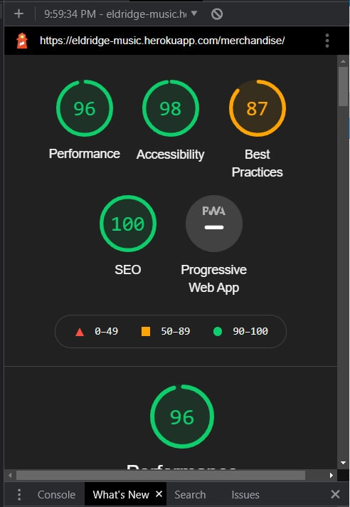
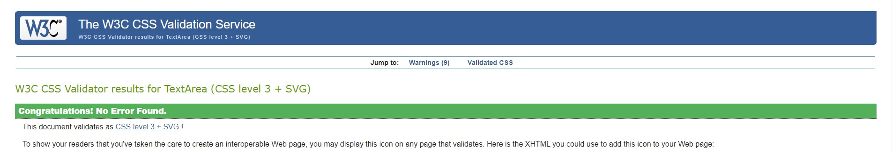
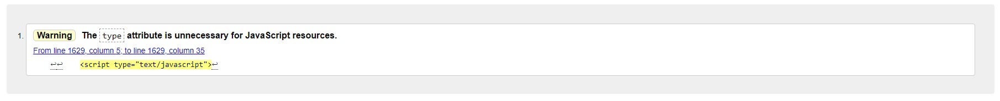
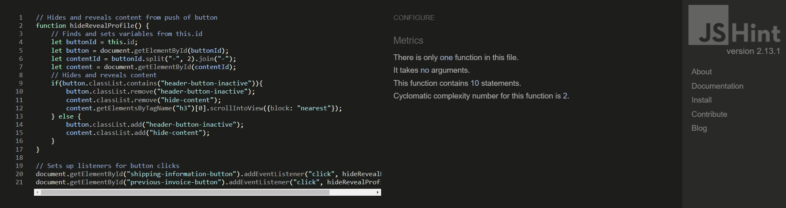
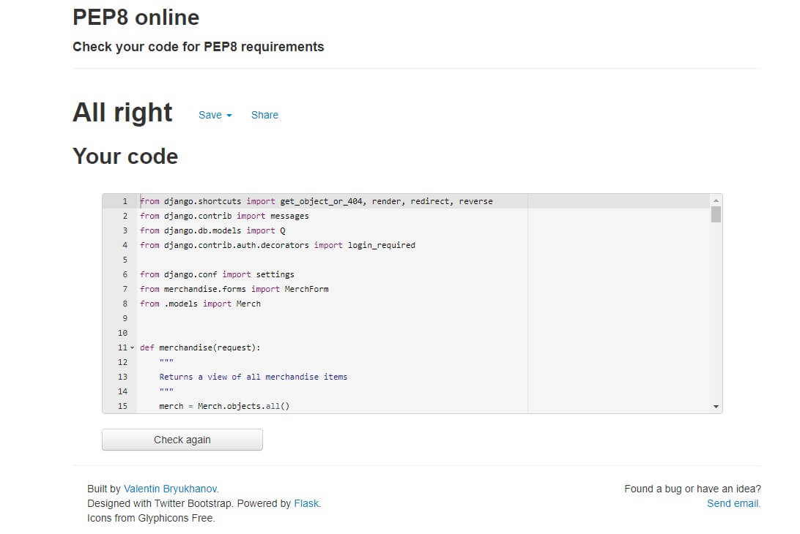

[Testing](#testing)
+ [Developer Testing Specifications](#developer-testing-specifications)
    + [Developer Testing Systems](#developer-testing-systems)
    + [Developer Testing Methods](#developer-testing-methods)
+ [Developer Tests](#developer-tests)
    + [Testing All Merchandise View](#testing-all-merchandise-view)
    + [Testing Merchandise Detailed Information View](#testing-merchandise-detailed-information-view)
    + [Testing Discounted Merchandise View](#testing-discounted-merchandise-view)
    + [Testing Shopping Cart](#testing-shopping-cart)
    + [Testing Piano Book Categories](#testing-piano-book-categories)
    + [Testing User Search Bar](#testing-user-search-bar)
    + [Testing Confirmation Email for Purchase](#testing-confirmation-email-for-purchase)
    + [Testing Account Creation](#testing-account-creation)
    + [Testing Account Confirmation Email](#testing-account-confirmation-email)
    + [Testing Login and Logout](#testing-login-and-logout)
    + [Testing Password Recovery](#testing-password-recovery)
    + [Testing Merchandise Rating System](#testing-merchandise-rating-system)
    + [Testing Invoice Function Remember My Information](#testing-invoice-function-remember-my-information)
    + [Testing Updating Shipping Information from Profile View](#testing-updating-shipping-information-from-profile-view)
    + [Testing the Superuser Function to Add Merchandise](#testing-the-superuser-function-to-add-merchandise)
    + [Testing the Superuser Function to Edit Merchandise](#testing-the-superuser-function-to-edit-merchandise)
    + [Testing the Superuser Function to Delete Merchandise](#testing-the-superuser-function-to-delete-merchandise)
+ [Program Tests](#program-tests)
    + [BrowserStack](#browserstack)
    + [Lighthouse](#lighthouse)
    + [JigSaw](#jigsaw)
    + [W3C Validator](#w3c-validator)
    + [JSHint](#jshint)
    + [PEP8 Online](#pep8-online)
+ [Return to README](#return-to-readme)
---------------------------------------------------

# Testing
## Developer Testing Specifications
### Developer Testing Systems
+ Windows 10 (Chrome 87**, Edge 87**, Firefox 84**)
    + Chrome
        + Developed in Chrome.
        + Initially tested in every bootstrap breakpoint during development.
        + Tested in landscape, which is desktop responsiveness level.
        + Tested in portrait, which is tablet responsiveness level.
    + Edge
        + Tested in landscape, which is desktop responsiveness level.
        + Tested in portrait, which is tablet responsiveness level.
    + Firefox
        + Tested in landscape, which is desktop responsiveness level.
        + Tested in portrait, which is tablet responsiveness level.
+ G8 ThinQ (Chrome 87**)
    + Chrome
        + Tested in landscape, which is tablet responsiveness level.
        + Tested in portrait, which is mobile responsiveness level.
+ iPad, 5th gen 13.3(Safari 13**)
    + Safari
        + Tested in landscape, which is tablet responsiveness level.
        + Tested in portrait, which is tablet responsiveness level.

### Developer Testing Methods
+ Each **Developer Test** was performed on the above listed systems and the specified screen orientations.
+ The tester will perform all **Developer Tests** three times:
    + Once in landscape.
    + Once in portrait.
    + Once with random moments of spam clicking and switching between landscape/portrait. This final test is critical to ensure tablet and mobile users have an enjoyable experience.

## Developer Tests

---

### Testing All Merchandise View

---

#### User Story
+ As a shopper I want to view all the merchandise in the store.

#### Expectation(s):
+ All the items in the merchandise model will be displayed.
+ The page content fills appropriately and doesn't spill out beyond obvious borders.
+ The page content doesn't overlap and is easy to read.

#### Assumptions(s):
+ The tester knows how many merchandise items are in the database.

#### Testing Step(s):
1. Load the **Home View** of Eldridge Music.
1. Click on **Piano Books** on the navigation bar.
1. Click on **All Music Books** from the **Piano Books** drop-down menu.
1. Count the number of merchandise items displayed in this view.

#### Documented Result(s):
1. If there is an incorrect number of displayed merchandise items, record:
    + The test name, number of displayed merchandise items, and a brief description of the problem.
1. If any links or images are broken, record:
    + The test name, image or link name, and a brief description of the problem.
1. If any content has bad UX, record:
    + The test name, screen resolution, browser/device, view (page), and a brief description of the bad UX.

---

### Testing Merchandise Detailed Information View

---

#### User Story
+ As a shopper I want to view detailed information about a piece of merchandise.

#### Expectation(s):
+ The tester will check five different detail views.
+ The page content fills appropriately and doesn't spill out beyond obvious borders.
+ The page content doesn't overlap and is easy to read.

#### Assumptions(s):
+ The tester knows the content that should display for each product they look at.
+ The tester knows multiple ways to get to a **Details View**.

#### Testing Step(s):
1. Load the **Home View** of Eldridge Music.
1. Navigate to the **Details View** of a merchandise item.
1. Check all the information of this merchandise item for correctness.
1. Repeat steps 1 - 3 choosing a different path to the **Details View** each time.

#### Documented Result(s):
1. If any information for the merchandise item is incorrect, record:
    + The test name, merchandise item name, incorrect information, anticipated information, and a brief description of the problem.
1. If any links or images are broken, record:
    + The test name, image or link name, and a brief description of the problem.
1. If any content has bad UX, record:
    + The test name, screen resolution, browser/device, view (page), and a brief description of the bad UX.

---

### Testing Discounted Merchandise View

---

#### User Story
+ As a shopper I want to see all discounted merchandise.

#### Expectation(s):
+ All the items with the boolean tag **special** will be displayed as discounted merchandise with a discount value.
+ The page content fills appropriately and doesn't spill out beyond obvious borders.
+ The page content doesn't overlap and is easy to read.

#### Assumptions(s):
+ The tester knows how many merchandise items are on discount.
+ The tester knows where the discount tag is displayed on the details and merchandise view.
+ The tester knows the correct price for each item.

#### Testing Step(s):
1. Load the **Home View** of Eldridge Music.
1. Click on **Speials** on the navigation bar.
1. Count the discounted merchandise items displayed.
1. Check each item for both the discount tag and discounted price.

#### Documented Result(s):
1. If there is an incorrect number of displayed discount merchandise items, record:
    + The test name, number of displayed merchandise items, and a description of the problem.
1. If a discounted merchandise item is displayed without a discount value, record:
    + The test name, merchandise item name, and a description of the problem.
1. If a discounted merchandise item is displayed with an incorrect new price, record:
    + The test name, merchandise item name, anticipated price, actual price, and a description of the problem.
1. If any links or images are broken, record:
    + The test name, image or link name, and a brief description of the problem.
1. If any content has bad UX, record:
    + The test name, screen resolution, browser/device, view (page), and a brief description of the bad UX.

---

### Testing Shopping Cart

---

#### User Story
+ As a shopper I want to view all the items in my cart.

#### Expectation(s):
+ All items selected for purchase will be displayed in the **Cart View** with the proper quantities.
+ The free delivery, for invoices above $50, function operates correctly.
+ Subtotal and grand total calculate properly in the **Cart View** and on the **cart icon**.
+ Success toasts show up for each item added to the cart and the toast contains all the correct information.
+ The page content fills appropriately and doesn't spill out beyond obvious borders.
+ The page content doesn't overlap and is easy to read.

#### Assumptions(s):
+ The tester will write down all merchandise selected for purchase and their quantities.
+ The tester knows there is an empty cart page and what it's supposed to look like.
+ The tester will watch the cart total and be sure it updates as they add merchandise to their cart.
+ The tester will start the test with an empty cart.
+ The tester knows that with a purchase of more than $50 there is no delivery fee.
+ The tester will monitor the success toasts and check for their accuracy.

#### Testing Step(s):
1. Load the **Home View** of Eldridge Music.
1. Click on the **cart icon** at the top right corner of the view.
1. Check for the correct empty **Cart View**.
1. Click on **Piano Books** on the navigation bar.
1. Click on **All Music Books** from the **Piano Books** drop-down menu.
1. Choose a random merchandise item and add a random quantity to the cart.
1. Repeat steps 4 - 6, four to nine times more.
1. Click on the **cart icon** at the top right corner of the view.
1. Check for a correct grand total, delivery total, and subtotal.
1. Empty cart.
1. Repeat steps 4 - 7. This time make sure the grand total is less than $50.
1. Check for a correct grand total, delivery total, and subtotal.

#### Documented Result(s):
1. If the empty **Cart View** does not display with an empty cart, record:
    + The test name and a brief description of the problem.
1. If the delivery cost doesn't update correctly according to the free delivery threshold, record:
    + The test name, all items with their quantities in the cart, and a brief description of the problem.
1. If the success toast doesn't work or displays incorrect information, record:
    + The test name, all items with their quantities in the cart, the last item and quantity selected, and a brief description of the problem.
1. If the subtotal, delivery total, and grand total do not properly calculate, record:
    + The test name, all items with their quantities in the cart, and a brief description of the problem
1. If any links or images are broken, record:
    + The test name, image or link name, and a brief description of the problem.
1. If any content has bad UX, record:
    + The test name, screen resolution, browser/device, view (page), and a brief description of the bad UX.

---

### Testing Piano Book Categories

---

#### User Story
+ As a shopper I want to be able to search available products by their category.

#### Expectation(s):
+ Each Category will display all the correct merchandise.
+ The page content fills appropriately and doesn't spill out beyond obvious borders.
+ The page content doesn't overlap and is easy to read.

#### Assumptions(s):
+ The tester knows all merchandise items that should appear in each category.
+ The tester knows the total of merchandise items that should appear in each category.

#### Testing Step(s):
1. Load the **Home View** of Eldridge Music.
1. Click on **Piano Books** on the navigation bar.
1. Click on **Seasonal** from the **Piano Books** drop-down menu.
1. Check the view for the correct number of merchandise items.
1. Check each additional category under **Piano Books** until all categories have been checked.

#### Documented Result(s):
1. If a category doesn't have the correct number of merchandise items, record:
    + The test name, the category, the total quantity of merchandise items present, a brief description of the problem, and any the incorrect merchandise items present or missing.
1. If any links or images are broken, record:
    + The test name, image or link name, and a brief description of the problem.
1. If any content has bad UX, record:
    + The test name, screen resolution, browser/device, view (page), and a brief description of the bad UX.

---

### Testing User Search Bar

---

#### User Story
+ As a shopper I want to be able to search for an item by its name or composer.

#### Expectation(s):
+ User search bar returns correct information when a user submits an item name or the name of its composer(s).
+ The page content fills appropriately and doesn't spill out beyond obvious borders.
+ The page content doesn't overlap and is easy to read.

#### Assumptions(s):
+ The tester knows all the merchandise offered from two different composers in the database.
+ The tester knows the names of four different books in database.

#### Testing Step(s):
1. Load the **Home View** of Eldridge Music.
1. Enter a composer's name into the user search bar.
1. Check returns for correct information.
1. Repeat step 2 - 3 with a different composer.
1. Enter a merchandise item's name into the user search bar.
1. Check returns for correct information.
1. Repeat step 5 - 6, three more times each with a different name.

#### Documented Result(s):
1. If any user search returns are incorrect, record:
    + The test name, whether a composer or item name was being searched for, the composer or item name, and a brief description of the problem.
1. If any links or images are broken, record:
    + The test name, image or link name, and a brief description of the problem.
1. If any content has bad UX, record:
    + The test name, screen resolution, browser/device, view (page), and a brief description of the bad UX.

---

### Testing Confirmation Email for Purchase

---

#### User Story
+ As a shopper I want to receive a confirmation email upon checkout

#### Expectation(s):
+ A confirmation email will be sent out after a purchase.
+ The page content fills appropriately and doesn't spill out beyond obvious borders.
+ The page content doesn't overlap and is easy to read.

#### Assumptions(s):
+ The tester knows the dummy codes for Stripe.
+ The tester has access to an email account.
+ The tester will create an account for this test and will keep a record of the account.
+ The tester knows the content of the confirmation email.
+ The tester will have their invoice number, date, subtotal, delivery total, grand total, and contact information written down.

#### Testing Step(s):
1. Load the **Home View** of Eldridge Music.
1. Be sure there is no current session or make sure to log out of the current session.
1. Put multiple merchandise items into the cart with different quantity quantities.
1. Proceed to checkout and finalize the checkout.
1. Check over the content of the confirmation email.
1. Load the **Home View** of Eldridge Music.
1. Log into an account.
1. Repeat steps 3 - 5.

#### Documented Result(s):
1. If the success toast does not display or displays incorrect information, record:
    + The test name, if the tester was logged in, anticipated toast information, actual toast information, and a brief description of the problem.
1. If the confirmation email is not received, record:
    + The test name, if the tester was logged in, the email name, the invoice number, and a brief description of the problem.
1. If any of the email content is incorrect, record:
    + The test name, if the tester was logged in, the content expected, actual content, and a brief description of the problem.
1. 1. Upon creation of a test account, record:
    + The username, email address of the account, and state that this is a test account.
1. If any links or images are broken, record:
    + The test name, image or link name, and a brief description of the problem.
1. If any content has bad UX, record:
    + The test name, screen resolution, browser/device, view (page), and a brief description of the bad UX.

---

### Testing Account Creation

---

#### User Story
+ As a new user I would like a create an account.

#### Expectation(s):
+ An account can be created, accessed, and updated.
+ The page content fills appropriately and doesn't spill out beyond obvious borders.
+ The page content doesn't overlap and is easy to read.

#### Assumptions(s):
+ The tester has access to an email account.
+ The tester will create an account for this test and will keep a record of the account information.

#### Testing Step(s):
1. Load the **Home View** of Eldridge Music.
1. Click on the **Profile** icon.
1. Click on **Create Account**.
1. Fill out the form and submit.
1. Open the email account the confirmation email was sent to and open the confirmation email.
1. Click on the confirmation URL in the email.
1. Check that the information provided on the **Confirm-Email View** is correct and then click **confirm**.
1. Log in with new account.
1. Click on the **Profile** icon.
1. Click on the **Profile** button.
1. Update **Shipping Info** and submit.
1. Check for accuracy.

#### Documented Result(s):
1. Upon creation of a test account, record:
    + The username, email address of the account, and state that this is a test account.
1. If the new account does not accept the login information, record:
    + The test name, the email name, the username, and a brief description of the problem.
1. If the new account information does not update, record:
    + The test name, the email name, the username, the anticipated information, current information, and a brief description of the problem.
1. If any links or images are broken, record:
    + The test name, image or link name, and a brief description of the problem.
1. If any content has bad UX, record:
    + The test name, screen resolution, browser/device, view (page), and a brief description of the bad UX.

---

### Testing Account Confirmation Email

---

#### User Story
+ As a new user I would like to receive a confirmation email after registering.

#### Expectation(s):
+ A confirmation email will be sent out at the end of the account creation process.
+ The page content fills appropriately and doesn't spill out beyond obvious borders.
+ The page content doesn't overlap and is easy to read.

#### Assumptions(s):
+ The tester has access to an email account.
+ The tester will create an account for this test and will keep a record of the account information.
+ The tester knows the content of both the confirmation email and the confirmation page.

#### Testing Step(s):
1. Load the **Home View** of Eldridge Music.
1. Click on the **Profile** icon.
1. Click on **Create Account**.
1. Fill out the form and submit.
1. Open the email account the confirmation email was sent to and open the confirmation email.
1. Click on the confirmation URL in the email.
1. Check that the information provided on the **Confirm-Email View** is correct and then click **confirm**.

#### Documented Result(s):
1. 1. Upon creation of a test account, record:
    + The username, email address of the account, and state that this is a test account.
1. If the information provided on the confirmation email or the confirmation page is incorrect, record:
    + The test name, the incorrect information, the anticipated information, and a brief description of the problem
1. If no confirmation email is received, record:
    + The test name, the email used, the account name used, and a brief description of the problem.
1. If any links or images are broken, record:
    + The test name, image or link name, and a brief description of the problem.
1. If any content has bad UX, record:
    + The test name, screen resolution, browser/device, view (page), and a brief description of the bad UX.

---

### Testing Login and Logout

---

#### User Story
+ As a returning user I would like to easily login or logout.

#### Expectation(s):
+ The tester can login and logout.
+ The page content fills appropriately and doesn't spill out beyond obvious borders.
+ The page content doesn't overlap and is easy to read.

#### Assumptions(s):
+ The tester will create an account for this test or use a pre-existing account. The tester will keep a record of the account.

#### Testing Step(s):
1. Load the **Home View** of Eldridge Music.
1. Click on the **Profile** icon.
1. Click on the **Login** button.
1. Log into Eldridge Music Book Emporium.
1. Verify that the toast appears for a login success.
1. Click on the **Profile** icon.
1. Click on the **Profile** button.
1. Check that the **Profile View** displays the correct account information.
1. Click on the **Profile** icon.
1. Click on the **Logout** button.
1. Click on **Sign Out**.
1. Verify that the toast appears for a logout success.
1. Click on the **Profile** icon.
1. Check for correct content of drop-down menu to verify the **Login** and **Create Account** options are listed.

#### Documented Result(s):
1. Upon creation of a test account or using a pre-existing account, record:
    + The username, email address of the account, and state that this is a test account.
1. If the login information was not accepted, record:
    + The test name, the email name, the username, and a brief description of the problem.
1. If the logout was not accepted, record:
    + The test name, the username, the email name, and a brief description of the problem.
1. If any links or images are broken, record:
    + The test name, image or link name, and a brief description of the problem.
1. If any content has bad UX, record:
    + The test name, screen resolution, browser/device, view (page), and a brief description of the bad UX.

---

### Testing Password Recovery

---

#### User Story
+ As a returning user I would like to recover my forgotten password.

#### Expectation(s):
+ A user can recover/change their current password.
+ The page content fills appropriately and doesn't spill out beyond obvious borders.
+ The page content doesn't overlap and is easy to read.

#### Assumptions(s):
+ The tester will create an account for this test or use a pre-existing account. The tester will keep a record of the account.

#### Testing Step(s):
1. Load the **Home View** of Eldridge Music.
1. Click on the **Profile** icon.
1. Click on the **Login** button.
1. Click on **Forgot Password?**.
1. Enter email for account and submit.
1. Open the email account the change password email was sent to and open the change password email.
1. Click on the change password URL contained in the email.
1. Create a new password and submit.
1. Login with the new password.

#### Documented Result(s):
1. Upon creation of a test account or using a pre-existing account, record:
    + The username, email address of the account, and state that this is a test account.
1. If no change password email is received, record:
    + The test name, the email used, the account name used, and a brief description of the problem.
1. If the new password does not work, record:
    + The test name, the username, the email name, and a brief description of the problem.
1. If any links or images are broken, record:
    + The test name, image or link name, and a brief description of the problem.
1. If any content has bad UX, record:
    + The test name, screen resolution, browser/device, view (page), and a brief description of the bad UX.

### Testing Merchandise Rating System

---

#### User Story
+ As a shopper I want to add a rating to a piece of merchandise.

#### Expectation(s):
+ The tester will rate three different pieces of merchandise.
+ The page content fills appropriately and doesn't spill out beyond obvious borders.
+ The page content doesn't overlap and is easy to read.

#### Assumptions(s):
+ The tester knows the the current number of ratings and the current average rating of each piece of merchandise.
+ The tester knows multiple ways to get to a **Details View**.

#### Math
1. a = current_avg_rating * total_reviews
1. z = total_reviews
1. b = a + rating_input
1. y = z + 1
1. new_avg =  b / y

#### Testing Step(s):
1. Load the **Home View** of Eldridge Music.
1. Navigate to the **Details View** of a merchandise item.
1. Record the number of ratings for the product as well as the current star rating.
1. Multiply the current average rating by the number of total reviews. Record this number.
    + Math step 1.
    + Math step 2.
1. Click on **Click to Rate**.
1. Input a random number 1 - 9.
1. Click **Rate Me!**.
1. Add your star rating to the number you calculated in step 4. Record this number.
    + Math step 3.
1. Check that the success toast appears.
1. Divide the number in step 8 by the total number of ratings (original number of ratings plus 1).
    + Math step 4.
    + Math step 5.
1. Record the number and compare with the new star rating.
1. Repeat steps 3 - 10 choosing a different path to the **Details View** each time.

#### Documented Result(s):
1. If the star rating is missing, record:
    + The test name, merchandise item name, and a brief description of the problem.
1. If the star rating counter is incorrect, record:
    + The test name, merchandise item name, incorrect count, anticipated count, and a brief description of the problem.
1. If the star rating is incorrect, record:
    + The test name, merchandise item name, incorrect rating, anticipated rating, formulas used, and a brief description of the problem.
1. If any links or images are broken, record:
    + The test name, image or link name, and a brief description of the problem.
1. If any content has bad UX, record:
    + The test name, screen resolution, browser/device, view (page), and a brief description of the bad UX.

---

### Testing Invoice Function Remember My Information

---

#### User Story
+ As a returning user I would like to have a personalized profile that has all my previous order information.

#### Expectation(s):
+ When **Remember My Information** box is checked it will update the user's shipping information.
+ The page content fills appropriately and doesn't spill out beyond obvious borders.
+ The page content doesn't overlap and is easy to read.

#### Assumptions(s):
+ The tester will create an account for this test or use a pre-existing account. The tester will keep a record of the account.
+ Tester knows Stripe dummy codes.

#### Testing Step(s):
1. Load the **Home View** of Eldridge Music.
1. Login or create an account for this test.
1. Remove all shipping information in the profile if any is present.
1. Proceed to checkout with any combination of items in the cart.
1. Fill out shipping information and check **Remember My Information**.
1. Submit order with Stripe's dummy information.
1. Open **Profile view** and check to see if shipping information has been updated.

#### Documented Result(s):
1. Upon creation of a test account or using a pre-existing account, record:
    + The username, email address of the account, and state that this is a test account.
1. If the shipping information is not updated, record:
    + The test name, the email name, the username, the anticipated information, the actual information, and a brief description of the problem.
1. If any links or images are broken, record:
    + The test name, image or link name, and a brief description of the problem.
1. If any content has bad UX, record:
    + The test name, screen resolution, browser/device, view (page), and a brief description of the bad UX.

---

### Testing Updating Shipping Information from Profile View

---

#### User Story
+ As a returning user I would like to update my shipping information.

#### Expectation(s):
+ The shipping information is updatable from the **Profile View**.
+ The page content fills appropriately and doesn't spill out beyond obvious borders.
+ The page content doesn't overlap and is easy to read.

#### Assumptions(s):
+ The tester will create an account for this test or use a pre-existing account. The tester will keep a record of the account.

#### Testing Step(s):
1. Load the **Home View** of Eldridge Music.
1. Proceed to **Profile View**.
1. Change all the information found within shipping information and update.
1. Check for accuracy.

#### Documented Result(s):
1. Upon creation of a test account or using a pre-existing account, record:
    + The username, email address of the account, and state that this is a test account.
1. If the shipping information does not update, record:
    + The test name, the email name, the username, the information anticipated, the actual information, and a brief description of the problem.
1. If any links or images are broken, record:
    + The test name, image or link name, and a brief description of the problem.
1. If any content has bad UX, record:
    + The test name, screen resolution, browser/device, view (page), and a brief description of the bad UX.

---

### Testing the Superuser Function to Add Merchandise

---

#### User Story
+ As a store manager I want to be able to add merchandise.

#### Expectation(s):
+ Any superuser can add merchandise.
+ The page content fills appropriately and doesn't spill out beyond obvious borders.
+ The page content doesn't overlap and is easy to read.

#### Assumptions(s):
+ The tester will have a pre-existing superuser account. The tester will keep a record of the account.
+ The tester will keep a record of all created merchandise. This includes the merchandise's name and SKU.
+ The tester will add SKU's that are test specific SKU.
+ The tester will create a test specific SKU with each merchandise item.
+ The tester will add an image to the merchandise item and keep a record of the image name.
+ The tester will have an image to upload as a merchandise image.

#### Testing Step(s):
1. Load the **Home View** of Eldridge Music.
1. Log into account.
1. Click on the **Profile** icon.
1. Click on the **Merchandise Management** button
1. Fill out the merchandise creation form.
1. Do not add an image to this merchandise item.
1. Submit the new merchandise and wait for the new page to load.
1. Check item information for accuracy.
1. Repeat steps 3, 4, and 5.
1. Add an image to this merchandise item.
1. Submit the new merchandise and wait for the new page to load.
1. Check item information for accuracy.

#### Documented Result(s):
1. Upon creation of a test account or using a pre-existing account, record:
    + The username, email address of the account, and state that this is a test account.
1. A merchandise item was created to fulfill the test's requirements, record:
    + The test name, the merchandise name, SKU, and state that this is test merchandise.
1. An image was used to fulfill the test's requirements, record:
    + The test name, the image name, and state that these are test image(s).
1. If the merchandise item information is incorrect, record:
    + The test name, the merchandise name, merchandise SKU, anticipated information, actual information, and a brief description of the problem.
1. If any links or images are broken, record:
    + The test name, image or link name, and a brief description of the problem.
1. If any content has bad UX, record:
    + The test name, screen resolution, browser/device, view (page), and a brief description of the bad UX.

---

### Testing the Superuser Function to Edit Merchandise

---

#### User Story
+ As a store manager I want to be able to edit merchandise.

#### Expectation(s):
+ Any superuser can edit merchandise.
+ The page content fills appropriately and doesn't spill out beyond obvious borders.
+ The page content doesn't overlap and is easy to read.

#### Assumptions(s):
+ The tester will have a pre-existing superuser account. The tester will keep a record of the account.
+ The tester will keep a record of all edited merchandise. This includes the merchandise's new name, new SKU, old name, and old SKU.
+ The tester will add/edit SKU's that are test specific SKU.
+ The tester will add an image to the merchandise item and keep a record of the image name.
+ The tester will have an image to upload as a merchandise image.
+ The tester will not edit any existing merchandise and will create new merchandise to edit.

#### Testing Step(s):
1. Load the **Home View** of Eldridge Music.
1. Log into account.
1. Proceed to the **Merchandise View** of any test merchandise.
1. Click the **Edit** button on the top right corner of the merchandise card.
1. Edit this merchandise's form.
1. Do not add an image to this merchandise item.
1. Submit the merchandise and wait for the page to load.
1. Check item information for accuracy.
1. Repeat steps 3, 4 and 5.
1. Add an image to this merchandise item.
1. Submit the merchandise and wait for the page to load.
1. Check item information for accuracy.

#### Documented Result(s):
1. Upon creation of a test account or using a pre-existing account, record:
    + The username, email address of the account, and state that this is a test account.
1. A merchandise item was edited to fulfill the test's requirements, record:
    + The test name, the merchandise name, SKU, and state that this is test merchandise.
1. An image was used to fulfill the test's requirements, record:
    + The test name, the image name, and state that these are test image(s).
1. If the merchandise item information is incorrect, record:
    + The test name, the merchandise name, merchandise SKU, anticipated information, actual information, and a brief description of the problem.
1. If any links or images are broken, record:
    + The test name, image or link name, and a brief description of the problem.
1. If any content has bad UX, record:
    + The test name, screen resolution, browser/device, view (page), and a brief description of the bad UX.

---

### Testing the Superuser Function to Delete Merchandise

---

#### User Story
+ As a store manager I want to be able to delete merchandise.

#### Expectation(s):
+ Any superuser can delete merchandise.
+ The page content fills appropriately and doesn't spill out beyond obvious borders.
+ The page content doesn't overlap and is easy to read.

#### Assumptions(s):
+ The tester will have a pre-existing superuser account. The tester will keep a record of the account.
+ The tester will keep a record of all deleted merchandise. This includes the merchandise's name and SKU.
+ The tester will keep a record of any image name that is a part of a deleted merchandise item.
+ The tester will not delete any existing merchandise and will create new merchandise to delete.

#### Testing Step(s):
1. Load the **Home View** of Eldridge Music.
1. Log into account.
1. Proceed to the **Merchandise View** of any test merchandise.
1. Select the **Delete** button on the top right corner of the merchandise card.
1. Search the app for the merchandise to be sure it was deleted.

#### Documented Result(s):
1. Upon creation of a test account or using a pre-existing account, record:
    + The username, email address of the account, and state that this is a test account.
1. A merchandise item was deleted to fulfill the test's requirements, record:
    + The test name, the merchandise name, SKU, and state that this is test merchandise.
1. An image was used to fulfill the test's requirements, record:
    + The test name, the image name, and state that these are test image(s).
1. If the merchandise item is not deleted, record:
    + The test name, the merchandise name, merchandise SKU, and state that this was supposed to be deleted.
1. If any links or images are broken, record:
    + The test name, image or link name, and a brief description of the problem.
1. If any content has bad UX, record:
    + The test name, screen resolution, browser/device, view (page), and a brief description of the bad UX.

## Program Tests
### BrowserStack
+ Removed from test because of usage limit being reached.

### Lighthouse
+ Identifies problems with performance, accessibility, best practices, and SEO.

+ Lists two vulnerabilities.
    + The use of jQuery@3.4.1
    + No CSP found in enforcement mode.

### JigSaw
+ Identifies errors in CSS

+ Warnings are present for some of the vendor extensions, but these extensions are necessary and the errors can be ignored.

### W3C Validator
+ Identifies errors in HTML.
+ Helpful for proper semantic HTML and ARIA standard practices.

+ Warnings are present for some of the JS because of the use of `type="text/javascript"`, but those errors can be ignored.

### JSHint
+ Identifies errors in JS.

### PEP8 online
+ Identifies errors in Python.

# Return to README
+ [Return to the README.md](README.md)